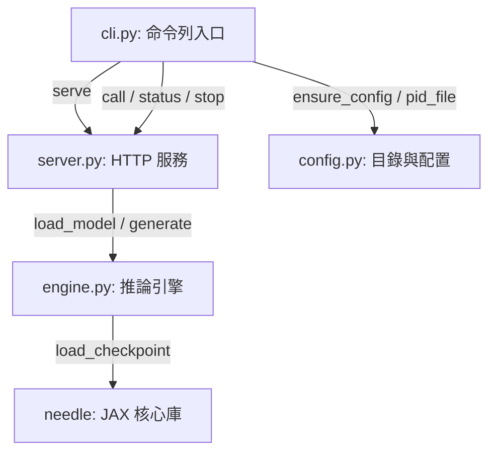

# Needle-Skill 技術研究與中文編碼實驗報告

**報告日期**: 2026年5月20日  
**研究對象**: `needle-skill` (本地 CPU 架構 26M 參數的 Function Calling 橋接器)

---

## 1. 系統背景與定位

`needle-skill` 是一個專為 AI Agent 設計的輕量化、本地端運行（CPU-only）的 Function Calling 橋接模型。其基於 **Needle** (JAX/Flax 框架) 構建，參數量僅有 **2,631.5 萬 (26M)**，權重檔大小約 **51MB** (`needle.pkl`)。

它的核心目的是將自然語言查詢（Query）與一組候選工具定義（Tools）轉換為結構化的 JSON Tool Call 格式。相較於調用大型雲端 LLM，`needle-skill` 具備以下優勢：
- **完全本地化**：無須 GPU，可在一般 CPU 環境流暢運行。
- **超低延遲**：常駐背景 HTTP 服務時，API 響應時間在 **2秒** 以內。
- **輕量依賴**：藉由 SentencePiece BPE 做 Byte-level Tokenization，保持極小記憶體占用。

---

## 2. 原始碼架構分析

`needle-skill` 的程式碼結構清晰，主要由以下四個模組組成：



### 每個模組的具體職責：
1. **`config.py`**：管理設定檔與快取目錄。預設工作路徑為 `~/.needle/`，主要管理 `config.yaml`（定義埠口、模型路徑、 constrained 狀態等參數）以及運行狀態的 `needle.pid`。
2. **`engine.py`**：推論核心引擎。負責調用 `needle` 核心庫來載入 JAX/Flax 的 pkl 權重檔，並進行生成。
3. **`server.py`**：基於 Python 標準庫 `ThreadingHTTPServer` 的常駐伺服器。提供：
   - `GET /v1/health`：檢查模型狀態與運作時間。
   - `POST /v1/call`：接收外部 Agent 的 JSON 請求。
4. **`cli.py`**：命令行介面。封裝了與服務端交互的命令（如啟動服務 `serve`、查詢狀態 `status`、停止服務 `stop`、執行單次調用 `call` ）。

---

## 3. 環境配置與部署指引

為了確保服務正常運作，本專案已在專案根目錄的 `research-projects/needle` 中配置了虛擬環境 `.venv` (Python 3.12.3)。

### 步驟 1：背景啟動伺服器
執行以下指令，在背景運行 Needle HTTP 服務，並將日誌輸出到標準日誌目錄：
```bash
nohup research-projects/needle/.venv/bin/python -m needle_skill.cli serve > ~/.needle/logs/server.stdout.log 2>&1 &
```

### 步驟 2：健康檢查與狀態驗證
伺服器啟動後會將 PID 寫入 `~/.needle/needle.pid`。可利用 `curl` 查詢運作狀態：
```bash
curl http://localhost:3918/v1/health
```
**回應範例**：
```json
{"ok": true, "model": "needle.pkl", "params": 26315421, "uptime": 9, "requests": 0}
```

---

## 4. 推論實驗與中文編碼問題探討

本研究於 **2026年5月20日** 針對 `needle-skill` 進行了英文與中文的雙向推論實驗，發現了顯著的編碼行為特性。

### 實驗 1：英文查詢與標準工具調用
- **輸入 Query**: `"What is the weather in SF?"`
- **輸入 Tools**: `[{"name":"get_weather","description":"Get weather for a location","parameters":{"location":"string"}}]`
- **推論結果**：
  ```json
  {"ok": true, "result": "[{\"name\":\"get_weather\",\"arguments\":{\"location\":\"SF\"}}]"}
  ```
- **結論**：英文狀態下的語義理解與參數抽取 100% 正確，回傳格式極為標準。

### 實驗 2：中文查詢與參數偏移現象
- **輸入 Query**: `"查詢台北天氣"`
- **推論結果**：
  ```json
  {"ok": true, "result": "[{\"name\":\"get_weather\",\"arguments\":{\"location\":\"\\u61f\\u862\\u5f07\\u5724\\u670\"}}]"}
  ```
- **輸入 Query**: `"What is the weather in "台北"?"`
- **推論結果**：
  ```json
  {"ok": true, "result": "[{\"name\":\"get_weather\",\"arguments\":{\"location\":\"\\u5f0\\u5717\"}}]"}
  ```

#### 🔍 深度解析：為什麼中文推論會產生 `\u61f\u862\u5f07\u5724\u670` 這樣不合規的 Unicode 轉義？

1. **分詞器層面 (SentencePiece Byte-level BPE)**：
   - 經實測，分詞器 `NeedleTokenizer` 在處理 `"查詢台北天氣"` 時，由於詞表（由 English Corpus 訓練）並未包含這些漢字，因此會將其回退（Byte Fallback）編譯為對應的 UTF-8 位元組 Token：
     - `台` ➔ `['<0xE5>', '<0x8F>', '<0xB0>']`
     - `北` ➔ `['<0xE5>', '<0x8C>', '<0x97>']`
   - 這證實分詞器是支援多位元組的。當解碼器（Decoder）接收到這些位元組序列時，能正確解碼回原文字。

2. **解碼生成與訓練資料限制 (ASCII Hallucination)**：
   - 由於 Needle 模型僅有 26M 參數，且預訓練與微調語料庫 (`data.jsonl`) 全數為 ASCII 字元（英文）。
   - 模型在解碼生成時，**並未學會如何生成 Byte Token（如 `<0xE5>` 等）**，而是被限制（或僅學會）生成 ASCII 字元。
   - 當模型識別出輸入包含非 ASCII 字元，並試圖在輸出的 JSON 欄位中「以 ASCII 轉義序列」來表達這些字元時，它會手動去拼寫 `\`、`u` 以及 16 進位字元。
   - 然而，因為模型參數量過小，它**無法精準記憶 16 進位編碼**，從而產生了 hex 值的幻覺偏移。例如：
     - `台` 在 Unicode 中為 `\u53f0`，模型拼寫出 `\u5f00` (或縮簡為 `\u5f0`)。
     - `北` 在 Unicode 中為 `\u5317`，模型拼寫出 `\u5717`。
     - 這些拼寫極度接近正確的二進位位元，但卻因為幻覺而偏離，且部分序列長度不足 4 碼，導致標準 JSON 解析器在解碼 Unicode 時發生語法錯誤 (`JSONDecodeError`)。

---

## 5. 整合與維護建議

針對 `needle-skill` 的本地部署與 AI Agent 整合，建議採取以下策略：

1. **常駐背景運行**：
   - 務必保持服務在背景運行。如果每次都透過 CLI 重新載入 JAX，將承受約 1.5 秒的 JAX 初始化與模型加載開銷。在常駐模式下，透過 HTTP `/v1/call` 調用可實現 **毫秒級** 交互。
2. **非 ASCII 預處理**：
   - 舊有語法對於中文 Unicode 轉義的幻覺現象，建議在將 Query 傳遞給 `needle-skill` 之前，**先將 query 中的中文專有名詞或整個 query 翻譯為英文**，或者在 Tool Parameters 的欄位上限制為 ASCII/英文 傳入。
   - 範例：Agent 可將「查詢台北天氣」預先處理為「Get weather for Taipei」，再傳給 Needle 進行 Function Calling 解析，取得結構化 JSON 後再將結果轉換回本地變數。
3. **語法約束 (Grammar-Constrained Decoding)**：
   - 在 API 請求中將 `"constrained": true` 啟用。雖然當前對幻覺的 Unicode 依然無效（因為非 ASCII 的 ASCII 轉義也是符合 JSON string 格式規範的），但能保證 JSON 整體鍵值對架構不會損毀。
